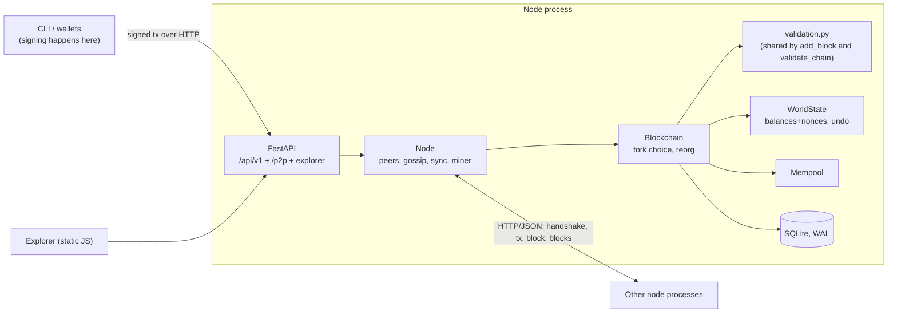

# BlockForge

A small **educational** blockchain in Python: signed transactions, Merkle trees, a state root,
proof-of-work, multi-process P2P networking with fork handling, a REST API, a web explorer and a CLI.

> **Not production software. It has no real monetary value and must never hold real money.**
> It exists to be read, run and broken. See [Educational simplifications](#educational-simplification-vs-production-requirement).

## Status

[](https://github.com/Srishti233/BlockForge/actions/workflows/ci.yml)

Every push runs GitHub Actions on Linux, Windows and macOS with Python 3.13:

- the full test suite (125 tests, including real multi-process node tests) with a 90% coverage gate on `blockchain/` and `storage/` (last measured: **97.99%**),
- the end-to-end `python demo.py`, which starts real node processes and asserts every step.

Not covered by automated tests: the explorer UI in a real browser (its API is tested, and its JavaScript only uses
same-origin requests). Open `http://127.0.0.1:5001/` after starting a node to try it. The checklist in
[Verifying your install](#verifying-your-install) lets you confirm everything on your own machine.

## What it is



## How it works

**Accounts and transactions.** Account model: each address has a balance and a nonce. A transaction
`{tx_id, sender, recipient, amount, fee, nonce, timestamp, public_key, signature, chain_id}` is signed over its canonical
JSON body (sorted keys, no whitespace, **integers only**). `tx_id = SHA-256(body)`. The signature is ECDSA/secp256k1/SHA-256,
fixed-width `r||s`, **low-S** (high-S is rejected, closing the malleability hole). An address is `"bf" + SHA-256(compressed pubkey)[:40]`;
the transaction's public key must hash to `sender` (ownership). The nonce must equal the account's next nonce *exactly*, and
`chain_id` is inside the signed body, so a transaction cannot be replayed twice or on another chain. Validation returns
structured `{code, message}` errors (`INVALID_SIGNATURE, BAD_OWNERSHIP, INSUFFICIENT_BALANCE, BAD_NONCE, BAD_AMOUNT, MALFORMED, WRONG_CHAIN, DUPLICATE`, ...).

**Merkle tree.** Leaves are tx ids hashed as `SHA-256(0x00||id)`, inner nodes `SHA-256(0x01||left||right)` (domain separation).
An odd level duplicates its last node. *Known caveat:* that makes `[a,b,c]` and `[a,b,c,c]` share a root (the Bitcoin
CVE-2012-2459 shape); block validation therefore rejects duplicate tx ids. Proofs are lists of `{hash, side}`;
`verify_proof(leaf, proof, root)` is standalone.

**Blocks and state root.** Header: `height, prev_hash, merkle_root, state_root, timestamp, difficulty_bits, nonce, miner`.
`block hash = SHA-256(canonical header)`. `state_root = SHA-256(canonical JSON of sorted {address: [balance, nonce]})` after
applying the block - stored in the header and verified. Each block carries exactly one coinbase, first, paying
`reward + sum(fees)`. `WorldState.apply_block` is atomic (all or nothing) and returns a diff so `undo_block` restores state exactly.

**Proof of work.** Valid iff `int(hash) <= 2**(256 - difficulty_bits)`. Difficulty is fixed by config (no retargeting).
Chain work per block is `2**256 // (target+1)`; cumulative work is the sum, and `difficulty_bits >= 1` is required (0 would give zero work).
Mining runs in a background thread and is interrupted whenever a new block arrives.

**Validation, one code path.** `validation.py` is used both by `add_block` (incremental) and `validate_chain` (full replay from
genesis, collecting *all* errors as `{height, code, message}`): genesis, links, hashes, Merkle roots, state roots, PoW, timestamps
(>= parent, <= now + 2h), signatures, balances, nonces, coinbase.

**Fork choice.** The chain with strictly more cumulative work wins; ties keep the current chain. Side-branch blocks are stored.
On a heavier branch the node undoes state back to the common ancestor, applies the new branch (re-validating every block against
state), re-adds orphaned transactions to the mempool, and records a fork event (time, ancestor height, old/new tip, depth).
If the new branch turns out invalid it rolls back and marks it invalid. `max_reorg_depth` (default 100) bounds reorgs.

**P2P.** Each node is a separate OS process speaking HTTP/JSON. *Handshake* exchanges `node_id, chain_id, genesis_hash, tip_height,
cumulative_work`; mismatched genesis or chain id is rejected. *Discovery:* seeds from config/CLI, peer-list exchange, persisted
peers, periodic health checks, pruning of dead peers. *Gossip:* txs and blocks are broadcast with a seen-set so they never loop.
*Sync:* a behind or late node downloads batches (validating each block); a block with an unknown parent triggers fetching ancestors
by hash. *Hostile input:* Pydantic schemas, request-size cap, per-IP rate limit, bad-data scoring with temporary bans; everything
is re-validated locally.

## Install and run

Python 3.13 recommended (3.11+ works).

```bash
# Linux / macOS
python3 -m venv .venv && source .venv/bin/activate
pip install -r requirements.txt -r requirements-dev.txt
```
```bat
:: Windows (cmd)
py -3.13 -m venv .venv && .venv\Scripts\activate
pip install -r requirements.txt -r requirements-dev.txt
```

**One node**
```bash
python run.py node --port 5001            # explorer: http://127.0.0.1:5001/   API docs: /docs
```
**Three nodes** (one terminal each; they must share chain id, difficulty and genesis allocations, which defaults do)
```bash
python run.py node --port 5001
python run.py node --port 5002 --peers 127.0.0.1:5001
python run.py node --port 5003 --peers 127.0.0.1:5001     # finds 5002 through 5001's peer list
```
**Demo** (designed to finish in under ~3 minutes, not yet timed; starts and cleans up its own processes) `python demo.py`
**Tests** `pytest` &nbsp;|&nbsp; with coverage: `pytest --cov=blockforge/blockchain --cov=blockforge/storage --cov-report=term-missing`

### CLI quick tour
```bash
python run.py wallet create alice            # passphrase prompt (or BLOCKFORGE_PASSPHRASE)
python run.py mine --address alice           # pays the block reward to alice's address
python run.py balance alice
python run.py wallet create bob
python run.py transaction send --from alice --to bob --amount 30 --fee 2   # signed locally
python run.py mempool ; python run.py mine --address alice ; python run.py balance bob
python run.py chain ; python run.py validate ; python run.py block 1
python run.py peers ; python run.py peers add 127.0.0.1:5002
```
`--node URL` (default `http://127.0.0.1:5001`) works before or after the subcommand. The `blockforge` console script is installed by `pip install -e .`.

## Reference

**Config precedence:** TOML (`--config`) < `BLOCKFORGE_*` env vars < CLI flags. See `config/blockforge.example.toml`. Invalid values fail fast.
Node flags: `--port --host --peers --miner ADDRESS --data-dir --difficulty --config --db-path --chain-id --block-reward --log-level --genesis-alloc ADDR=AMOUNT`.

**API** (`/api/v1`, errors are `{"error":{"code","message"}}`): `GET /node`, `/chain/info`, `/chain/validate`, `/chain/forks`, `/blocks?limit&offset`,
`/blocks/{height_or_hash}`, `/transactions/{id}` (block, confirmations, Merkle proof), `POST /transactions`, `GET /mempool`, `/accounts/{address}`,
`POST /mine`, `/miner/start`, `/miner/stop`, `GET/POST /peers`, `GET /merkle/proof/{tx_id}`, `POST /merkle/verify`.
Internal: `/p2p/handshake, /p2p/peers, /p2p/status, /p2p/tx, /p2p/block, /p2p/blocks, /p2p/block/{hash}`.
`/docs` is a small **offline** viewer generated from `/openapi.json` (the stock Swagger UI loads assets from a CDN, which would violate "no external requests").
**No endpoint accepts or returns a private key; signing is client-side only** (CLI/wallet module).

**Explorer** (`/`): Dashboard (auto-refresh), Blocks, Block, Transaction with a *Verify Merkle Proof* button (asks the API *and* recomputes every hash
in the browser with WebCrypto, showing each step), Network (peers + fork events), Search. All rendered data is HTML-escaped; CSP is `default-src 'self'`.

**Demo/test-only hooks:** `--test-hooks` (config `test_hooks`) exposes `/p2p/partition` and `/p2p/heal` so the demo can split real processes. Off by default; never enable on a real node.

## Project structure
```
blockforge/blockchain/  crypto wallet transaction merkle block consensus state mempool validation blockchain
blockforge/network/     protocol peer node sync          blockforge/storage/database.py
blockforge/api/         schemas routes                   blockforge/explorer/  index.html app.js style.css (+docs.html docs.js)
blockforge/cli/main.py  config.py logging_setup.py       tests/  config/  demo.py  run.py  pyproject.toml
```

## Educational simplification vs. production requirement

| Educational simplification | Production would need |
|---|---|
| No peer authentication or encryption (plain HTTP, self-declared `addr`/`sender`) | Authenticated, encrypted transport (e.g. Noise/TLS), peer identity |
| Simplified address scheme (truncated hash, no checksum or versioning) | Checksummed, versioned addresses |
| Fixed difficulty, no retargeting | Difficulty adjustment, timestamp/median-time rules |
| Naive peer discovery (peer-list exchange, no eclipse resistance) | Diverse peer selection, address books, anti-eclipse measures |
| No DoS economics (rate limit per IP, size cap, ban score only) | Resource accounting, fee-market mempool policy, replace-by-fee |
| Single-threaded miner, Python `json` hashing | Optimised/ASIC mining, native code |
| Whole chain replayed on startup; one global lock | Incremental state DB, UTXO/trie commitments, fine-grained concurrency |
| Merkle odd-node duplication (mitigated by duplicate-tx rejection) | Designs that avoid the ambiguity entirely |
| Genesis has no PoW; allocations come from config | Audited genesis ceremony |
| Passphrase on CLI flag allowed (warned as insecure) | Hardware wallets / OS keychains |
| Fee is burned into the coinbase; no block-size/weight economics | Weight limits, fee estimation |

## Known limitations
- The two sides of a gossip hop trust nothing, but they also **authenticate nothing**: anyone can claim any peer address and consume that address's bad-data score.
- Orphan-block pool and mempool are in memory only. A bounded orphan cache can drop blocks under flood.
- Reorg is bounded by `max_reorg_depth`; a deeper valid, heavier chain is stored but refused (logged as `reorg_refused`).
- Timestamps use integer Unix seconds from each node's local clock.
- Transactions pending in one node's mempool are not re-requested by a peer that missed the gossip.
- Only the code paths listed under *Status* were executed by the author; see above.

## Future improvements
Difficulty retargeting; authenticated transport; compact block relay and header-first sync; persistent mempool; snapshot/pruning; UTXO or trie state commitments; WebSocket push for the explorer.

## Verifying your install
1. Fresh venv; `pip install -r requirements.txt -r requirements-dev.txt`.
2. `pytest --cov=blockforge/blockchain --cov=blockforge/storage` - all green.
3. One node: `python run.py node --port 5001`; in another shell create a wallet, `mine`, `transaction send`, `mine`, `balance`.
4. Three nodes as above; a late fourth node (`--peers 127.0.0.1:5001`) syncs.
5. Stop and restart a node; the tip and balances persist.
6. `python demo.py` ends with `DEMO COMPLETE`.
7. Open `http://127.0.0.1:5001/` and `/docs`; the browser dev-tools network tab shows only same-origin requests.
8. `grep -rn "TODO\|FIXME\|NotImplemented" blockforge/` prints nothing.
